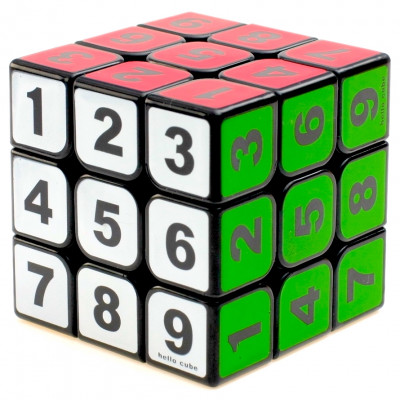
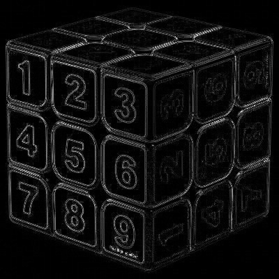
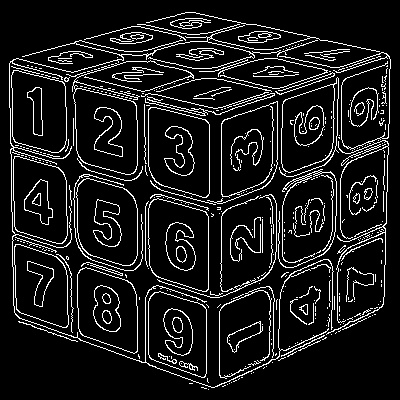

# Report on diffrent edge dettection methods

Three diffrent edge detection methods were tested on the following image and their results were analyzed

## Laplacian Edge detection method

Laplacian edge detection seems to work well on surfaces with little noise and clear color contrast, such as on the the white faces with clear black digits.

Shiny digits such as those on the blue and red faces are barely recognizable, with the red face being totaly unreadable

## Sobel edge detection

Sobel edge detection appearsd to be really blury with non unifom edges, making didigts on white face readable, digits on green face less clear, and digits on red face are not visible

## Canny edge detection

Canny edge detection appears to be the most accurate and clear method, showing all digits clearly. The only didgits that are slightly distorted are the ones the red face, but this is probably due to the angle of the image. The only slight disadvantage of canny edge detection method is that since it picks up alot of details, some noise is detected.

## Other examples

